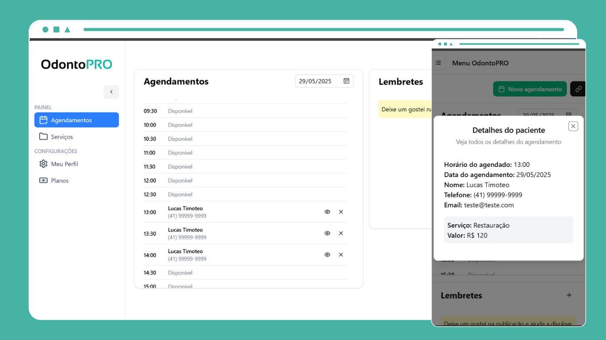

<div style="display: flex; flex-direction: column; text-align: center;">
    <h1>OdontoPRO - Sistema para Clínicas</h1>
    
</div>

## Sumário

- [\[odontopro\]](#)
  - [Sumário](#sumário)
  - [Introdução](#introdução)
  - [Descrição Geral](#Descrição-Geral)
  - [Tecnologias Usadas](#tecnologias-usadas)
  - [Principais Funcionalidades](#pricipais-funcionalidades)
  - [Snapshots](#snapshots)
  - [Como Executar o Projeto](#como-executar-o-projeto)
  - [Links Úteis](#links-úteis)
  - [Contato](#contato)

## Introdução

Este é um projeto de sistema Sass para clínicas, com objetivo principal de organizar e facilitar o agendamento de consultas e também oferecer serviços para clientes. Cada clínica possui uma agenda que pode ser acessada pelos clientes e verificar a disponbilidade de horários e datas, os clientes também coseguem agendar suas consultas por meio de links de cada clínica.

## Descrição Geral

O *OdontoPRO* é um sistema completo para clínicas, onde:
- *Clínicas* usam a interface web para gerenciar e agendar consultas e ofercer serviços.
- *Clientes* podem agendar consultas, escolhecendo o serviço oferecido e os horários disponíveis.

## Tecnologias Usadas

&nbsp;
&nbsp;
&nbsp;
&nbsp;
&nbsp;
&nbsp;
&nbsp;


- *Linguagem*: TypeScript
- *Framework*: Next 15
- *Ferramentas de Desenvolvimento*:
  - Utilizado Neon Serverless Postgres com prismaORM para banco de dados;
  - Imagens estão hospedadas no Cloudnary;
  - Utilizado TailwindCSS e Shadcnui para estilização;
  - Utilizado [Sonner](https://www.npmjs.com/package/sonner) para mostrar toasts;
  - Hospedagem da aplicação foi realizada na Vercel;
  - Login realizado com o Google oAuth e NextAuth.js;

## Pricipais funcionalidades

### 1. *Consultas e Serviços*
- *Agendar consultas*: As clínicas podem agendar consultas na sua agenda, quando tem disponbilidade para aquela data e horário disponpivel.
- *Criar serviços*: As clínicas podem cadastar serviços para oferecer a seus clientes respeitando o limite contratado pela assinatura mensal.
- *Gerenciar consultas*: As clínicas podem acessar suas consultas e verificar qual o serviço que será feito, além dos valores e informações do cliente.
- *Criar Lembretes*: As clínicas podem criar lembretes e verificar sempre que acessar a conta.

### 2. *Agendamento e horários (Cliente)*
- *Agendar consulta*: Os clientes podem agendar uma consulta para uma clínica específica e verificar quais os horários disponíveis.
- *Consultar clínicas*: Consultar todas as clínicas disponíveis na plataforma e ver todos os serviços oferecidos. 

### 3. *Autenticação e Cadastro*
- Autenticação de usuários realizada com NextAuth.js e Google oAuth.

### 4. *Assinaturas de serviços*
- *Clínicas premium*: Acesso ao cadastro ilimitado de serviços e selo premium na página home.
- *Clínicas básicas*: Acesso limitado ao cadastro de serviços.
- *Gerenciamento de assinatura*: Pagamento de plano mensal usando o Stripe.

## Snapshots

### Home


### Agendamentos da Clínica



### Cadastrar agendamento


### Cadastrar serviços


### Informações da Clínica


### Planos para clínicas


### Criando assinatura com Stripe


## Como Executar o Projeto

### Pré-requisitos

- Node.js - Version 22.11.0
- [Neon](https://console.neon.tech/app/projects) PostgreSQL v17 ou banco de dados com integração ao PrismaORM.
- Conta ativa na [Cloudnary](https://cloudinary.com) para hospedagem de imagens.
- Conta na Google [Cloud](https://developers.google.com/identity/protocols/oauth2?hl=pt-br) para login dos usuários.
- Conta ativa na [Stripe](https://stripe.com/br) para receber pagamentos e crair os planos.
- (Opcional) configurar webhook local do [stripe](https://docs.stripe.com/webhooks?locale=pt-BR)

1. Clone o repositório:
  ```bash
  git clone https://github.com/LucasDoGit/odontopro
  cd odontopro
  ```

2. Instale as dependências:
  ``` bash
  npm install --force
  ```

3. Crie o arquivo .env na raiz do projeto e configure as variáveis de ambiente, conforme abaixo.
  ```env
  AUTH_SECRET="" # chave secreta aleatória, pode ser gerada com "npx auth secret"
  DATABASE_URL="" # url do seu banco de dados

  # cloudnary
  AUTH_GITHUB_ID= # oAuth id github
  AUTH_GITHUB_SECRET= # chave secreta do github

  # google
  AUTH_GOOGLE_ID= # oAuth id google
  AUTH_GOOGLE_SECRET= # chave secreta do google

  NEXT_PUBLIC_URL=http://localhost:3000 # ou a url de hospdedagem

  # stripe 
  NEXT_PUBLIC_STRIPE_PUBLIC_KEY= # chave publica do stripe
  STRIPE_SECRET_KEY= # chave secreta do stripe

  STRIPE_SECRET_WEBHOOK_KEY= # chave secreta do webook do stripe

  STRIPE_PLAN_BASIC= # id da assinatura básica do stripe
  STRIPE_PLAN_PROFESSIONAL=# id da assinatura básica do stripe
  STRIPE_SUCCESS_URL=http://localhost:3000/dashboard/plans # url de sucesso ao criar assinatura
  STRIPE_CANCEL_URL=http://localhost:3000/dashboard/plans # url para o cancelamento de assiantura

  # cloudnary
  CLOUDINARY_NAME=# nome de indentificação no cloudnary
  CLOUDINARY_KEY=# chave de acesso ao cloudnary
  CLOUDINARY_SECRET=# chave secreta do cloudnary
  ````

4. (opcional) Configurar webook local para receber eventos do stripe.
  - Baixar o stripe CLI e seguir a documentação para clicando neste [link](https://docs.stripe.com/webhooks) para configurar o webook local.

5. Criar as migrations com o prisma
  ```bash
  npx prisma generate 
  npx prisma migrate dev
  ```

6. Execute o comando:
  ```bash
  npm run dev
  ```
  

5. Feito! O projeto deve ser iniciado e pode ser acessado usando um navegador web pelo *localhost* ou a *url de hospodagem* do seu projeto.

## Links Úteis

- Google oAuth docs - [Link](https://developers.google.com/identity/protocols/oauth2?hl=pt-br)
- Github oAuth docs - [Link](https://docs.github.com/en/apps/oauth-apps/building-oauth-apps/authorizing-oauth-apps)
- Stripe docs - [Link](https://docs.stripe.com/)
- Integração prismaORM com Neon - [Link](https://www.prisma.io/docs/orm/overview/databases/neon)

## Contato

Para obter mais informações, entre em contato comigo em:

- Email: lucas.saiz19@gmail.com
- GitHub: https://github.com/LucasDoGit